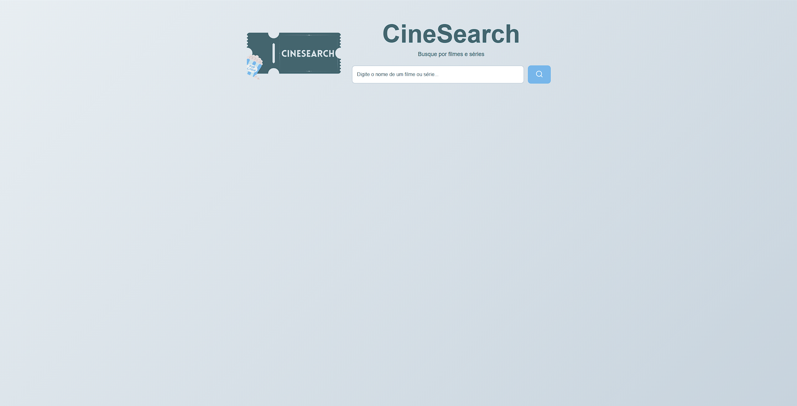
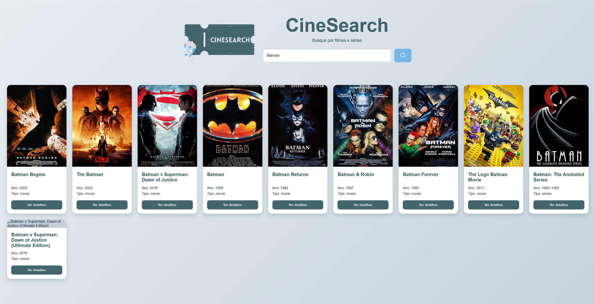
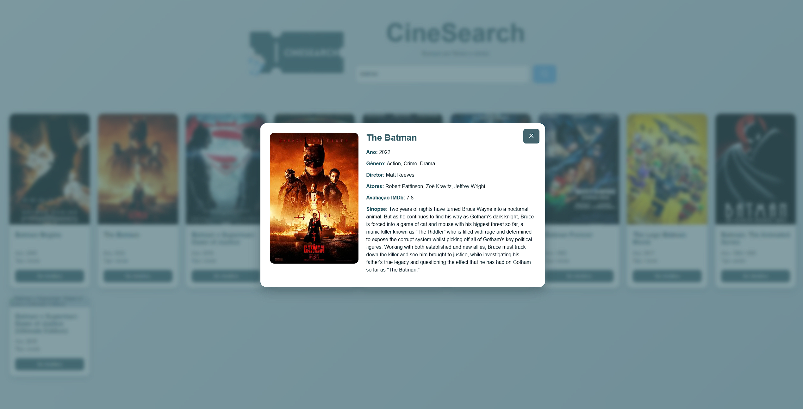
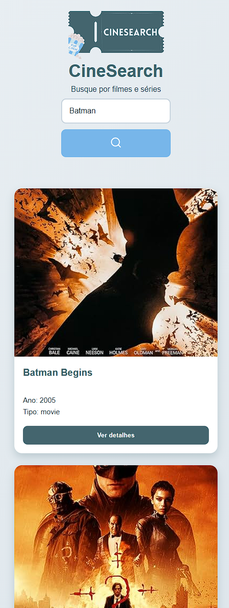

# CineSearch

O **CineSearch** é uma aplicação web desenvolvida com **React** que permite pesquisar filmes e séries utilizando a **OMDb API**. O usuário pode digitar o nome de um filme ou série, visualizar os resultados em cards e acessar mais detalhes sobre a obra selecionada.

---

## 1. Descrição do objetivo

O objetivo deste projeto é desenvolver um mini projeto em React para demonstrar alguns conceitos importantes da biblioteca, como:

* Componentes;
* Props;
* Estado;
* Eventos;
* Consumo de API;

O projeto escolhido foi um **buscador de filmes e séries**.
A aplicação permite que o usuário pesquise por um título e visualize informações como:

* Nome do filme ou série;
* Ano de lançamento;
* Tipo;
* Pôster;
* Gênero;
* Diretor;
* Atores;
* Avaliação IMDb;
* Sinopse.

---

## 2. Softwares necessários

Para executar este projeto, é necessário ter instalado:

### Node.js

O Node.js é necessário para executar comandos JavaScript fora do navegador e para utilizar o gerenciador de pacotes npm.

Verifique se o Node.js está funcionando com o comando:

```bash
node -v
```

Verifique também o npm:

```bash
npm -v
```

### Visual Studio Code

O Visual Studio Code foi utilizado como IDE(*Integrated Development Environment*) do projeto

### Navegador Web

Um navegador foi utilizado para visualizar e testar a aplicação.

---

## 3. Passo a passo para o desenvolvimento

### 3.1 Criação do projeto

O projeto foi criado utilizando o Vite com React e JavaScript.

```bash
npm create vite@latest react-lista-filmes
```

Depois, foi acessada a pasta do projeto e instaladas as dependências:

```bash
cd react-lista-filmes
npm install
```

Para executar o projeto localmente:

```bash
npm run dev
```

---

### 3.2 Instalação de biblioteca adicional

Foi instalada a biblioteca `react-icons`, usada para adicionar o ícone de lupa no botão de busca.

```bash
npm install react-icons
```

---

### 3.3 Organização do projeto

A estrutura principal do projeto ficou organizada da seguinte forma:

```text
src/
├── assets/
│   ├── logo.ico
│   └── cinesearch.png
├── components/
│   ├── SearchBar.jsx
│   ├── MovieCard.jsx
│   └── MovieDetails.jsx
├── App.jsx
├── index.css
└── main.jsx
```

Os componentes foram separados para facilitar a organização do código:

* `SearchBar.jsx`: barra de pesquisa;
* `MovieCard.jsx`: card com as informações básicas do filme;
* `MovieDetails.jsx`: modal com os detalhes do filme;
* `App.jsx`: componente principal com os estados e chamadas à API.

---

### 3.4 Desenvolvimento da aplicação

Primeiro, foi criada a interface principal com o título, a logo e a barra de pesquisa.

Em seguida, foi implementado o consumo da OMDb API. A busca utiliza o nome digitado pelo usuário para retornar uma lista de filmes e séries.

```javascript
`https://www.omdbapi.com/?apikey=${API_KEY}&s=${search}`
```

Depois, os resultados retornados pela API foram exibidos em cards utilizando o componente `MovieCard`.

Também foi criada a função para buscar os detalhes de um filme específico, utilizando o IMDb ID.

```javascript
`https://www.omdbapi.com/?apikey=${API_KEY}&i=${id}&plot=full`
```

Esses detalhes são exibidos em um modal por meio do componente `MovieDetails`.

---

### 3.5 Estilização

A estilização foi feita no arquivo `index.css`.

---

### 3.6 Testes

Foram realizados testes pesquisando filmes e séries, como:

```text
Batman
Harry Potter
Avengers
Spider-Man
Breaking Bad
```

Também foram feitos testes com nomes inválidos para verificar a exibição de mensagens de erro.

---

## 4. Imagens do processo e resultados

### Tela inicial



### Resultado da busca



### Modal de detalhes



### Versão responsiva



---

## 5. Como executar o projeto

Clone o repositório:

```bash
git clone https://github.com/lsantosfelipe1/react-lista-filmes
```

Acesse a pasta do projeto:

```bash
cd react-lista-filmes
```

Instale as dependências:

```bash
npm install
```

Execute o projeto:

```bash
npm run dev
```

Abra o endereço local informado no terminal.

---

## 6. Tecnologias usadas

* React;
* JavaScript;
* Vite;
* HTML;
* CSS;
* OMDb API;
* React Icons;
* Visual Studio Code;
* Node.js;
* npm.

---

## 7. Créditos e fontes de referência

As seguintes fontes foram usadas como apoio para o desenvolvimento do projeto:

### OMDb API

Link: https://www.omdbapi.com/

A OMDb API foi usada para buscar os dados dos filmes e séries. 
---

### Tutorial em vídeo

Link: https://www.youtube.com/watch?v=oy4cbqE1_qc

O vídeo foi utilizado como apoio para entender a criação de projeto usando React com consumo de API. Foram adaptadas ideias relacionadas à busca de dados, organização da interface e exibição dos resultados.

---

### React

Link: https://react.dev/

A documentação oficial do React foi usada para consulta dos principais conceitos da biblioteca, como componentes, estado, props, eventos.

---

### Vite

Link: https://vite.dev/

A documentação do Vite foi usada como referência para criação e execução do projeto React. O Vite foi usado para configurar o ambiente de desenvolvimento de forma mais simples e rápida.

---

### React Icons

Link: https://react-icons.github.io/react-icons/

A documentação do React Icons foi usada para escolher e importar o ícone de lupa utilizado no botão de pesquisa da aplicação.

---

### Vercel

Link: https://vercel.com/

O Vercel foi usada para hospedagem e publicação do projeto, permitindo disponibilizá-lo online.

---

### ChatGPT

Link: https://chatgpt.com/

O ChatGPT foi utilizado como ferramenta de apoio durante o desenvolvimento do projeto, auxiliando na organização do README, na revisão de explicações, na melhoria de comentários do código e no esclarecimento de dúvidas sobre React, consumo de API e estrutura do projeto.

As informações técnicas principais foram conferidas com as documentações oficiais utilizadas no trabalho.
